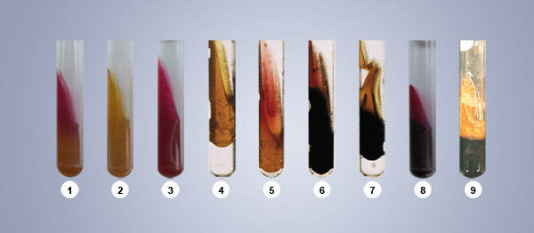
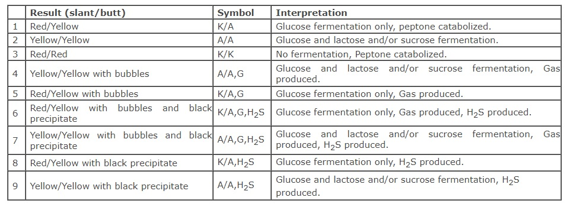

## Materials Required:

&nbsp;

### Culture:
 

24 hour typticase soy broth culture.

 

&nbsp;

### Media:
 

Triple sugar-iron agar slants.

 

&nbsp;

### Equipments:
 

1. Bunsen burner

2. Inoculating needle

3. Test tubes

4. Marking pen
 

&nbsp;

### Media preparation: Triple sugar-iron agar (pH 7.4):
 

Add 3.0 gram of Beef extract, 3 gram of yeast extract, 15 gram of peptone, 5 grams of protease peptone, 10.0 grams of lactose, 10.0 gram of saccharose, 1.0 gram of glucose, 0.2 gram of ferrous sulphate, 5.0 gram of sodium chloride, 0.3 gram of sodium thiosulphate, 0.024 gram of phenol red and 12 gram of agar and make the mixture up to 1000ml with distilled water.

&nbsp;

The Peptone mixture and the Beef and Yeast extracts provide the nutrients essential for growth. Sodium chloride maintains the osmotic balance of the medium. The Bacteriological agar is the solidifying agent.

&nbsp;

## Procedure:-
 

1. Sterilize the inoculating needle in the blue flame of the bunsen burner till red hot and then allowed to cool.

2. From the rack, take the Trypticase soy broth tube containing the 24-48 hour culture, remove the cap and flame the neck of the tube.

3. Using aseptic technique, take the culture of the organism from the TSB (tryptic soy broth) tube with the needle.

4. Again flame the neck of the tube and replace the tube in the test tube rack.

5. Take a sterile TSI slant tube from the rack, remove the cap and flame the neck of the tube.

6. Stab the needle containing the pure culture into the medium, upto the butt of the TSI tube, and then streak the needle back and forth along the surface of the slant.

7. Again flame the neck of the TSI tube, cap it and place it in the test tube rack.

8. Incubate at 37oc for 18 to 24 hours.
 

&nbsp;

&nbsp;

### Expected Results:
 

Only glucose fermentation has occurred. The organisms preferentially degrade glucose first. Since this substrate is present in minimal concentration, the small amount of the acid produced on the slant surface is oxidized rapidly. The peptones in the medium are also used in the production of alkali. At the butt, the acid reaction is maintained because of the reduced oxygen tension and slower growth of the organisms.

 
&nbsp;

Lactose or sucrose fermentation has occurred. Since these substances are present in higher concentrations, they serve as substrates for continued fermentative activities with maintenance of an acid reaction in both the slant and the butt.

 
&nbsp;

No carbohydrate fermentation has occurred. Instead; peptones are catabolized under anaerobic and /or aerobic conditions resulting in alkaline pH due to production of ammonia. If only aerobic degradation of peptones occurs, the alkaline reaction is evidenced only on the slant surface. If there is aerobic and anaerobic utilization of peptone, the alkaline reaction is present on the slant and the butt.

&nbsp;

 

Some bacteria utilize thiosulfate anion as a terminal electron acceptor, reducing it to sulfide. If this occurs, the newly-formed hydrogen sulfide   (H2S) reacts with ferrous sulfate in the medium to form ferrous sulfide, which is visible as a black precipitate. The blackening of the medium is almost always observed in the butt (bottom) of the medium.

&nbsp;

It is recognized simply as bubbles of gas between the agar and the wall of the tube or within the agar itself. The carbon dioxide production is sufficient to split the agar into two or more sections. To obtain accurate results, it is absolutely essential to observe the cultures within 18-24 hours following incubation. This will ensure that the carbohydrate substrates have not been depleted and that degradation of peptones yielding alkaline end products has not taken place.

 
&nbsp;

1. Alkaline slant (red) and acid butt (yellow) with or without gas production (breaks in the agar butt):

2. Acid slant (yellow) and acid butt (yellow) with or without gas production:

3. Alkaline slant (red) and alkaline butt (red) or no change (orange-red) butt:

4. Hydrogen sulfide (H2S) production:

5. Carbon dioxide (CO2) production:

&nbsp;

&nbsp;

&nbsp;

&nbsp;

### Real Lab Scenarios:
 
&nbsp;

1.	The medium should be correctly prepared in order to provide the maximum amount of information. It should be poured as a slant (also called as a slope) in a tube which is at an angle such that the area of the surface (or the slant position ) is increased so that its longest dimension is approximately the same as the depth of the lower portion(called the butt or the deep) at approximately 2.5-3 cm; this results in the surface being aerobic and the butt relatively anaerobic.

2.	 Tubes are preferably screw capped containers because the reactions which characterize the growth of different organisms are dependent upon oxidative reactions, and oxygen access to the agar surface is better in such a tube.

3.	 The medium is designed to detect the Enterobacteriaceae, and because it contains no selective agents it will support the growth of a wide range of bacteria. The mere presence of the growth on the medium, therefore has no significance.  It is the characteristics of the growth that is important. So the medium must be inoculated with a pure culture, often an isolated colony from another identification medium, and there will not be any useful information if it is inoculated with a mixed culture.

4.	 Do not use an inoculating loop to inoculate a tube of Triple Sugar Iron Agar. While stabbing the butt, mechanical splitting of the medium occurs, causing a false positive result for gas production.

5.	If an organism can ferment any of the three sugars present in the TSI Agar medium, the medium will turn yellow. If an organism can only ferment glucose, the small amount of glucose in the medium is used by the organism within the first ten hours of incubation. After that time, the reaction that produced acid reverts in the aerobic areas of the slant, and the medium in those areas turns red, indicating alkaline conditions. The anaerobic areas of the slant, such as the butt, will not revert to an alkaline state, and they will remain yellow. This happens with Salmonella and Shigella.

6.	TSI Agar medium should be read after an incubation of only 24 hours because a longer incubation time can cause a false negative. Vigorous fermenters such as Escherichia coli and Entrobacter cloacae will ferment all the available sugars and then begin using the amino acids. This will produce amine groups and cause the medium to turn alkaline.

7.	 If an organism can reduce sulfur, the hydrogen sulfide gas which is produced will react with the iron to form iron sulfide, which appears as a black precipitate. If the precipitate is formed, it can mask any acid/alkaline results. Sulfur reduction requires an acidic environment, so if the black precipitate is present, some fermentation took place. If the butt of the slant is obscured by the precipitate, look at the top of the slant to determine if the organism could ferment only glucose (red), or if it could ferment either lactose and/or sucrose (yellow).

8.	If the fermentation produced gas, you may see fissures in the medium, or the entire slant may be raised above the bottom of the test tube.
 
 
&nbsp;

### Limitations of the procedure:
 
&nbsp;

1.	 Some organism may demonstrate Hydrogen sulfide production on Kligler Iron Agar, but not on TSI Agar because utilization of sucrose in TSI agar suppresses the enzyme mechanism that results in the production of H2S. Specifically, H2S producing Salmonella and some members of Enterobacteriaceae may not be H2S positive on TSI Agar.

2.	H2S producing organisms on TSI Agar may produce so much of black precipitate, ferrous sulfide, that the acidity produced in the butt is completely masked.

3.	 Sucrose is added to TSI to eliminate some sucrose-fermenting non-lactose fermenters, such as Proteus and Citrobacter spp.

4.	 Further biochemical tests and serological typing must be performed for definite identification and confirmation of organisms.
